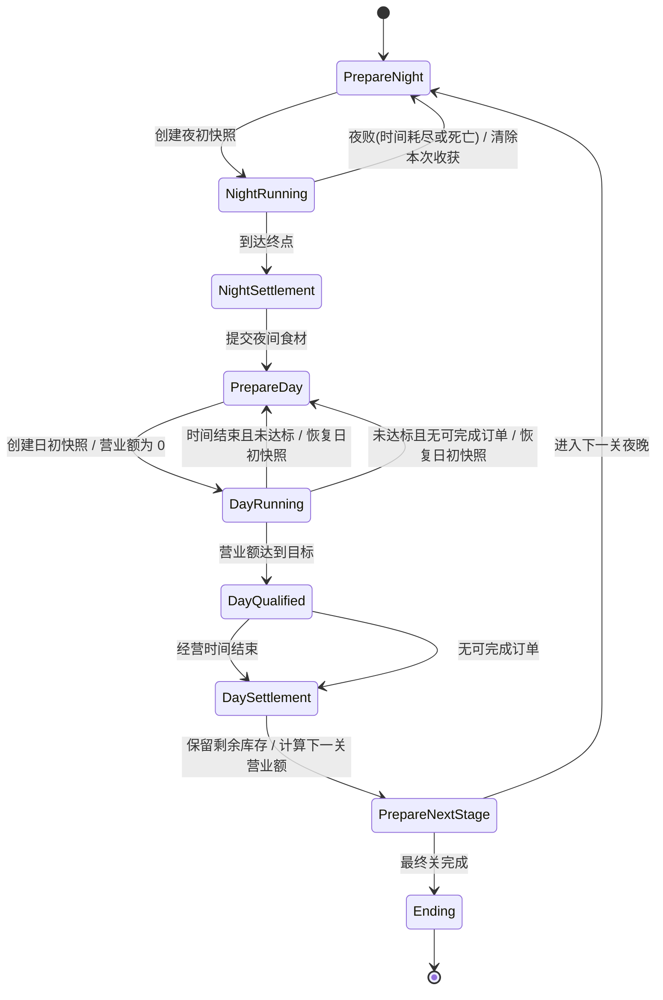

# 全功能三分线（订单 1 + 跑酷 2）

依据：`【新】我在异世界当厨师-策划案.pdf`  
修订原因：原 **C 昼夜账本偏中台**，跨线接口多、联调反而增；团队希望 **跑酷主玩法加人力**。  
新约束：

1. **案中全部功能**仍必须落入三人之一（无第四功能岗）。  
2. **取消独立中台**；原 C 的表/库存/切关/谢礼规则 **并入订单线**，昼夜只保留 **一次去、一次回** 的薄交接。  
3. 人力：**跑酷 2 人** + **订单（白天经营）1 人**。  
4. R2 执行计划见：`Docs/R2_Gameplay_Plan.md`。

---

## 总览

| 线 | 代号 | 行业近似 | 一句话 | Content 根 |
|---|---|---|---|---|
| **跑酷·手感** | **R1** | **≈ 3C**（Character / Camera / Control）+ 判定与角色侧手感 | 双键手感、判定、灶魂、主角夜、换键输入、相机 | `/Game/Night/Feel/` |
| **跑酷·关卡** | **R2** | **≈ Gameplay / 关卡内容** | 轨道生成、岔路 A/B/C、怪障掉落、雾、夜关卡执行、夜向 Buff 生效 | `/Game/Night/Course/` |
| **订单·食肆** | **S** | **≈ 经营 / 订单 / 进度**（非 3C、非夜玩法 Gameplay） | 白天整局 + 原中台：库存/营业额/菜表/客与谢礼/Flow 切关/存档/组下夜包 | `/Game/Day/` |
| **共用配置** | **Shared** | Day/Night 共用 DataTable | 关卡阶段、菜谱、食材、NPC、谢礼、顾客名等；后续 Night 表也放这里 | `/Game/Shared/Data/` |

```text
S 组装 NightBootstrap ──一次──► R2 开夜（内部调 R1）
R2 回传 NightResult   ──一次──► S 入库 / 开店 / 日结 / 写存档
```

**禁止再出现** `Meta.Get*` / `Meta.Commit*` 中转层。R1↔R2 同属夜关，用模块引用，不经 S。

---

## 薄交接（仅这两包，降联调）

### S → 夜（开局一次）

```text
FNightBootstrap
  LevelId
  ForkPair          // AB / AC / BC（S 按关卡脚本/牌袋决定）
  GiftBuffState     // 两件谢礼已解析成夜侧可读开关/数值
  FoeWeightOverride // 可选：饕餮食盒定向等
  Seed              // 评审固定 Seed
```

### 夜 → S（结束一次）

```text
FNightResult
  bSuccess          // 是否到达出口
  RouteTaken        // A/B/C
  Ingredients[]     // ID + 数量（已含带出增益后的结果）
  SoulLeft
  bFailedMidway     // 魂灭；S 按规则做 50% 保留等
```

除此之外 **不设** 共享 GameInstance 子系统给第三人维护。库存、营业额缺口、下夜 Build 全部在 **S** 内聚。

---

## R1 — 跑酷·手感（1 人）≈ 3C

> **≈ 3C**：Character / Camera / Control；外加跳劈判定窗、动画锁、灶魂与换键**输入**（仍属角色侧手感，不是关卡编排）。

### 功能清单

| 策划点 | R1 交付 |
|---|---|
| 竖屏 2.5D、角色约屏高 72%、无左右移动 | 夜相机 + `BP_HeroNight` |
| 左跳 / 右劈、判定窗、起跳/劈锁时长 | Input + 判定核心 + Montage |
| 灶魂灯逻辑：自然衰减、失误扣、连正奖、0.6s 无敌、0–100 | 灶魂组件（数据驱动表现参数） |
| C 换键时的 **输入映射与功能交换**（清队列、安全窗内不生成由 R2 调） | 换键 Input 状态 |
| 受击/成功的动画通知、锁定期间吞输入 | AnimNotify 约定 |
| 焦纸死亡可播放接口 | 供 R2 在魂灭时调用 |

### R1 不做

- 不生成轨道节点、不实现岔路牌、不刷怪表  
- 不持有库存/菜谱/谢礼规则  

### 对 R2 接口（夜关内部）

```text
R1.BindToTrack(TrackPawnApi)
R1.SetControlScheme(Normal | Swapped)
R1.TryJump() / TrySlash() -> JudgeSample
R1.ApplySoulDelta(...) / GetSoul()
R1.PlayCharredPaper()
```

R2 负责「何时该判、窗从哪来」；R1 负责「这一下跳/劈算不算、锁多久、灶魂怎么变」。

---

## R2 — 跑酷·关卡（1 人）≈ Gameplay

> **≈ Gameplay / 关卡内容**：路怎么铺、岔怎么难、怪怎么掉、夜规则与 Buff 怎么生效；不负责 3C 手感本体。

### 功能清单

| 策划点 | R2 交付 |
|---|---|
| 基础段→唯一岔口→分支段→出口缓冲；`T_beat`、节点密度 | 轨道/节拍生成器 |
| 岔口 AB/AC/BC；左右键选路；超时保底；选路不计失误 | 岔口状态机 + 路线牌 UI |
| A/B/C 规则：可见块、扣血差、蚀火/逆火 DoT、掉料、掉落节奏、带出 +20%/+30% | 路线规则执行 |
| B 雾：只压可见块，不改速度与判定窗 | 可见距离参数（雾皮可 TA） |
| C 换键次数与时点；安全窗前后停生成；调 R1 换键 | 关卡事件表 |
| 五怪一击、五料掉落、优势池 70/30、障碍 | 怪/障 Actor + 夜侧表 |
| 生成约束：最小间隔、同类连续上限、岔口期不刷、分支 1.2s 缓冲等 | 生成器 |
| 夜关卡行（时长、岔口时点、权重）**执行态** | `DT_NightLevels`（S 可只读同表或开局打进 Bootstrap） |
| 谢礼 **夜生效**：纸鸢信息、借命、定键、饕餮改前 4 怪 | 读 `GiftBuffState` 执行 |
| 聚 `FNightResult` 回传 S | 夜 GameMode/Director |

### R2 不做

- 不开白天店、不 Merge、不做谢礼页签 UI  
- 不实现跳劈判定窗公式（归 R1），只喂「判定线时刻」  

### 对 S / R1

```text
R2.StartNight(FNightBootstrap)      // 仅 S 调用
R2.OnNightFinished(FNightResult)    // 回 S
// 内部
R2 -> R1 提供判定线与事件；R1 回传命中/失误
```

---

## S — 订单·食肆（1 人，吞并原中台）≈ 经营

> **≈ 经营 / 订单 / 进度**：开店与闭环账本；不是夜关 3C，也不是夜玩法 Gameplay。

### 功能清单（白天 + 原 C）

| 策划点 | S 交付 |
|---|---|
| 开店时长、营业额目标、达标仍跑完时长 | 日 GameMode |
| 母棋子、不规则棋盘、同链同级 Merge→Lv4、高级食材拖回整个食材区撤销合成并退库、拖菜交付 | Merge 全套 |
| 普通客皮套潮、无限等待（无耐心值）、`CustomerConcurrentMax` 驱动的共享座位（各自独立补客倒计时；任一空座归零即从统一队列补客，不等整批完成）、完成订单即离店（含特殊 NPC）、开店前预生成订单队列（库存硬可行、总价≥目标、等级混搭）、特殊 NPC 按队列前半段揭示 | 客潮 |
| 四特殊 NPC、保底规则由表决定、对白 | NPC |
| 谢礼**完成订单即得即用**、无选礼无背包、入夜前只读页签展示 | 谢礼即时生效 + 页签 |
| 25 菜链/价/耗材、客潮等级权重、结转单价、座位上限、食材/NPC/谢礼/顾客名 | `/Game/Shared/Data/`：`DT_Recipes`、`DT_GameStages`、`DT_SDayBalance`、`DT_Ingredients`、`DT_SpecialNpcs`、`DT_Gifts`、`DT_CustomerNames`（Day/Night 共用；后续 Night 表也放此目录） |
| 库存、夜/日失败各自回档本阶段起点、时间到闭店结转剩余食材并抬高下一关目标 | **进度与库存（原 C）** |
| T0–L3 总流程、15 分钟结构、评审 Seed/配对牌袋、存档 | **Flow + Save（原 C）** |
| 组装 `FNightBootstrap`、消费 `FNightResult` | **唯一昼夜胶水** |
| 主角日形、菜品表现、谢礼卡面 | 日人物与 UI |
| §7 脚本中的日段事件；夜段时间表可写在 Bootstrap/脚本行交给 R2 | 脚本表主责在 S |

### S 不做

- 不实现双键判定、轨道刷怪、灶魂衰减曲线  
- 夜关内不跑；只 `StartNight` / 等结果  

### 状态机（`ESGamePhase`，唯一权威）



规则：

- `PrepareDay` / `DaySettlement` / `PrepareNextStage` 是**过渡态**：在同一次调用里做完边上的事就交棒，UI 不会停在这三个态。
- **回档粒度**：夜败回夜初快照，日败回日初快照；快照含库存、营业额、营业额目标与谢礼，棋盘不入档（棋子按付费单位折回库存后清盘）。中途读档同样按「回到本阶段起点」处理。
- **永久入库**：阶段中途发放的永久库存（含调试「五类各+10」）走 `GrantPermanentStock`，同时补进夜初/日初快照，否则存档读回时会被回档吃掉；正常消耗只改当前库存，仍按回档退回。
- **订单预生成**：`EnterPrepareDay` 根据日初库存与营业额目标生成 `PlannedDayOrders`（客单 + 特殊 NPC 槽）；总售价≥目标且 `Cost(Lv)=2^Lv` 硬可行；NPC 槽落在前半段；售价读 `DT_Recipes`。顾客/NPC 按队列出现，日初快照携带队列保证回档一致。
- **谢礼**：完成 NPC 委托当场进 `ActiveGiftIds` 并写入 `GiftBuffState`，立刻可用；在 `PrepareDay` 清空（上一日谢礼已被刚过去的夜晚消耗）。没有勾选、没有背包。
- **闭店条件**：开店倒计时归零，或库存与棋盘都做不出任何一道菜（`HasCompletableOrder()==false`）。倒计时由 `ASCustomerDirector::Tick` → `TickDayClock` 驱动。
- **结转**：仅「时间结束」的日结把剩余食材留到下一关，并按 `CarryOverTargetBonusPerUnit`（默认 5 = Lv0 半价）抬高下一关营业额目标；「食材耗尽」不结转。
- 存档 `SG_ChefProfile` 版本 **3**：含订单队列与游标；v2 及更旧档判为不兼容并回退默认档。

---

## 人物资产落点

| 人物 | 归属 |
|---|---|
| 主角夜、跳劈、焦纸 | **R1** |
| 五怪、障碍剪影 | **R2** |
| 主角日、8 皮套客、四特殊 NPC | **S** |
| 谢礼卡面 | **S**；夜生效逻辑 **R2** |
| 食材/怪/菜/礼/关卡 **规则表** | **S** 为经营与总流程主表；夜生成专用行可由 R2 维护 `DT_NightLevels`/`DT_Foes`，开局以 Bootstrap 为准避免双写 |

---

## 全案追溯（防漏）

| 策划块 | 主责 |
|---|---|
| §1–2 循环与 15 分钟 | **S** Flow |
| §3.1 操作与判定窗、动画锁 | **R1** |
| §3.2 灶魂 | **R1**（表现可 TA） |
| §3.3 岔路与 A/B/C、换键时点 | **R2**（换键输入 **R1**） |
| §3.4–3.6 怪料、关卡参数、生成约束 | **R2** 执行；权重/期望表可与 S 共享只读 |
| §3.7 失败回档（夜败回夜初、日败回日初） | **S** 规则；**R2** 上报失败 |
| §4–5 经营与 25 菜 | **S** |
| §6 NPC 与谢礼 | **S** 发放与规则（即得即用）；**R2** 夜生效 |
| §7 四关脚本 | **S** 总表；夜事件 **R2** 执行、日事件 **S** 执行 |

---

## TA 介入（少量，挂 R1/R2/S）

原则不变：TA **不**当功能 owner；只做材质/Niagara/移动端贵的表现。

| 优先级 | 工作 | 挂靠 |
|---|---|---|
| **P0** | 灶魂纸灯视觉档位 | R1 |
| **P0** | 五怪命中 Niagara 模板 | R2 |
| **P0** | B 瘴雾「只压可见」 | R2 |
| **P1** | 换键键图标过渡 | R1+R2 |
| **P1** | 焦纸溶解 | R1 |
| **P1** | 客皮套换色 MI、Merge/菜升级材质 | S |
| **P2** | 谢礼卡纸质 Shader、移动端合批体检 | S / 跨线 |

**不必 TA：** 判定窗、生成算法、Merge 规则、谢礼发放、存档。

---

## 并行示意

### 第 1 周

- **R1**：双键 + 灶魂 + 英雄白模可 PIE  
- **R2**：直线节拍刷假怪/障 + 假结果结构  
- **S**：假 `NightResult` 进店 Merge 两链 + 假客；库存/营业额雏形  

### 第 2 周

- **R1↔R2**：真判定线对接；换键联调（仅二人）  
- **R2↔S**：只对接 Bootstrap/Result；谢礼夜生效  
- **S**：特殊 NPC、谢礼即时生效、T0 夜→日→夜 Flow  
- **TA**：纸灯 + 命中特效（白模可玩后）

### 联调契约

1. 跨昼夜 **只准** `FNightBootstrap` / `FNightResult`。  
2. R1 不引用 S；S 不引用 R1。S 只调 R2 夜入口。  
3. R1/R2 可互相引用 Night 模块；改判定窗只动 R1，改刷怪只动 R2。  
4. 枚举 `EIngredientId` 等：**S 定稿**，R2 产出必须对齐（或 Shared 头文件仅枚举，S 库管）。

---

## 一句话派活

1. **R1（≈3C）**：跳得准、砍得爽、灶魂与换键手感。  
2. **R2（≈Gameplay）**：路怎么长、岔怎么难、怪怎么掉、夜 Buff 怎么生效。  
3. **S（≈经营）**：店怎么开、菜怎么合、客与谢礼、账怎么记、关怎么切、下夜包怎么打。  

原中台 C **撤销**；联调面从「三人三角」收成「夜内二人一条线 + 昼夜一个包」。
